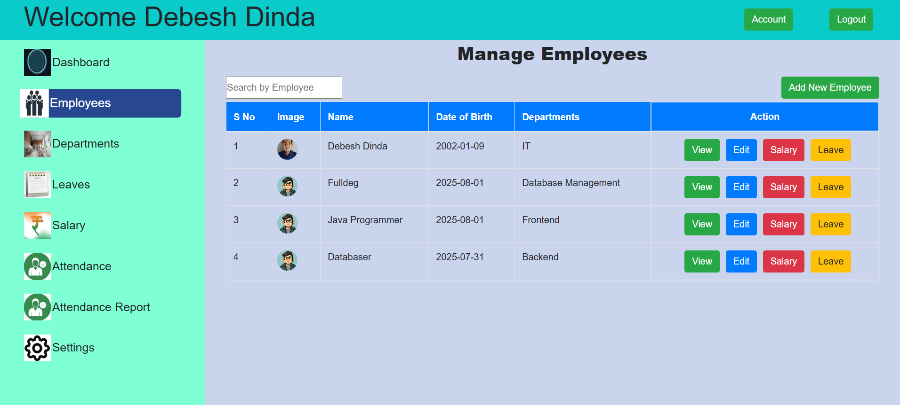

# Employee Management System

A **full-featured web application** to manage employees, departments, salaries, attendance, and leaves.  
Built with a clean user interface and role-based access (Admin & Employee), this system helps organizations streamline HR and payroll processes.

---

##  Key Features

###  Authentication
- Secure login with email & password  
- Role-based access: redirect to **Admin** or **Employee** dashboard  

---

### 🛠 Admin Dashboard
- **Overview Panel**:  
  - Total employees  
  - Total departments  
  - Monthly payroll summary  
  - Leave statistics (applied, approved, pending, rejected)  

- **Employees Management**  
  - View employee details with salary & leave history  
  - Add new employees  
  - Edit employee information  
  - Track leave requests (date, duration, reason, status)  
  - Search employees by name  

- **Departments Management**  
  - View, add, edit, and delete departments  
  - Search departments by name  

- **Leaves Management**  
  - View all leave requests  
  - Approve or reject leaves  
  - Search leaves by employee ID or status  

- **Salary Management**  
  - Add salary details (basic, allowances, deductions, pay date)  
  - View salary history of employees  

- **Attendance Management**  
  - Mark employees as Present, Absent, Sick, or Leave  
  - Search employees by name  
  - Generate attendance reports by date range  

- **Settings & Account**  
  - Change login password  
  - View admin profile  
  - Logout  

---

###  Employee Dashboard
- **Welcome Dashboard** with personalized message  
- **My Profile**: view employee details with profile image  
- **Leaves**:  
  - View leave history  
  - Submit new leave requests  
  - Filter leaves by status  

- **Salary**:  
  - View salary details  
  - Check payment history  

- **Attendance Report**:  
  - Track daily attendance (Present, Absent, Sick, Leave)  
  - Filter attendance by date  

- **Settings & Account**:  
  - Change password  
  - View profile  
  - Logout  

---

## 🛠 Tech Stack
- **Frontend:** React + Vite, HTML, CSS, JavaScript  
- **Backend:** Node.js / Express.js (role-based authentication, APIs)  
- **Database:** MongoDB   
- **Other Tools:** Git, GitHub, npm  

---

## 📸 Screenshots
 
Example:  

  



 


---

##  Installation & Setup

1. Clone the repository  
   ```bash
   git clone https://github.com/debesh993/employee-management-system.git

##  Future Enhancements
- Export reports in PDF/Excel
- Email notifications for leave approvals
- Biometric/QR-based attendance
- Role-based multi-admin access


## 👨‍💻 Author
- **Debesh Dinda**  
- [GitHub](https://github.com/debesh993) | [LinkedIn](www.linkedin.com/in/debesh-dinda-50b347301)  
